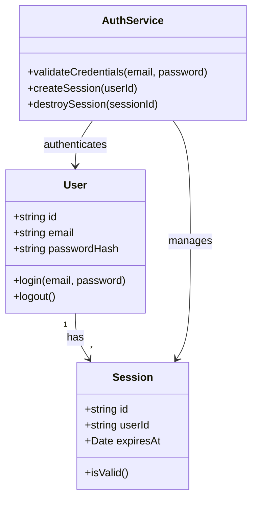
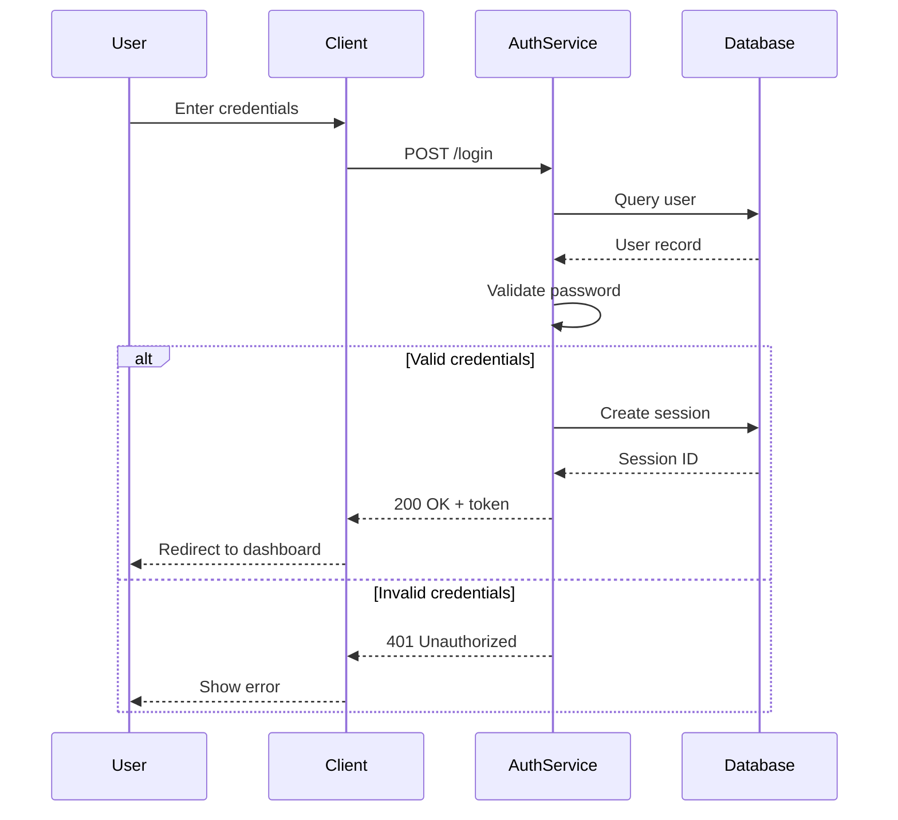
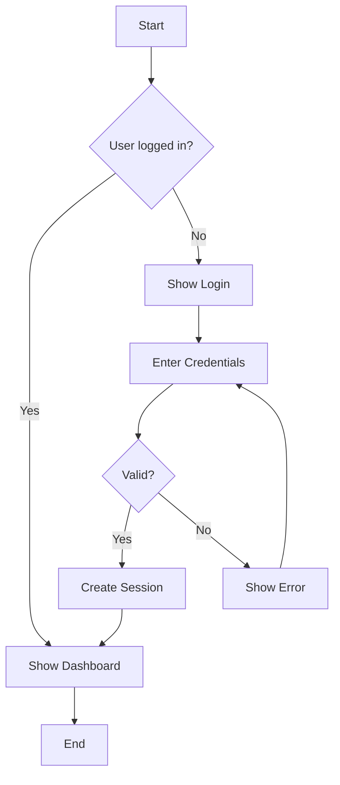

# Diagram Generation

Generate UML diagrams in Mermaid format based on the SRS and codebase.

## Usage

```
/saga diagram              # Interactive - ask which type
/saga diagram class        # Generate class diagram
/saga diagram sequence     # Generate sequence diagram
/saga diagram flow         # Generate flowchart
/saga diagram all          # Generate all diagram types
```

## Pre-requisites

1. Check if `.saga/srs.md` exists for requirements context
2. Check if `.saga/plan.json` exists for feature context
3. Create `.saga/diagrams/` directory if not exists

## Diagram Types

### 1. Class Diagram (`class`)

Analyze the codebase to generate a class diagram showing:
- Classes and interfaces
- Properties and methods
- Relationships (inheritance, composition, association)

**Output:** `.saga/diagrams/class.mmd`



### 2. Sequence Diagram (`sequence`)

Generate sequence diagrams for key flows from:
- SRS functional requirements
- User stories in plan.json

**Output:** `.saga/diagrams/sequence-[flow-name].mmd`



### 3. Flowchart (`flow`)

Generate flowcharts for:
- Business processes
- Decision trees
- Data flows

**Output:** `.saga/diagrams/flow-[process-name].mmd`



## Generation Process

### For Class Diagrams

1. Use the Explore agent to scan the codebase:
   - Find all class/interface definitions
   - Extract properties and methods
   - Identify relationships

2. Generate Mermaid syntax

3. Save to `.saga/diagrams/class.mmd`

### For Sequence Diagrams

1. Read `.saga/srs.md` for functional requirements
2. For each major feature (or user-specified flow):
   - Identify actors/participants
   - Map the sequence of interactions
   - Include alternative flows

3. Save to `.saga/diagrams/sequence-[name].mmd`

### For Flowcharts

1. Read `.saga/srs.md` for processes
2. Identify decision points and flows
3. Generate Mermaid flowchart syntax
4. Save to `.saga/diagrams/flow-[name].mmd`

## Interactive Mode

If no argument provided, ask:

```
What type of diagram would you like to generate?

1. Class diagram - Show system structure and relationships
2. Sequence diagram - Show interaction flows
3. Flowchart - Show process/decision flows
4. All - Generate all diagram types

Enter your choice (1-4):
```

For sequence diagrams, also ask:
```
Which flow should I diagram?
- All major flows from SRS
- Specific flow: [describe the flow]
```

## Output Format

After generation, display:

```
Diagram Generated: .saga/diagrams/class.mmd

Preview:
┌─────────────────────────────────────┐
│ [Mermaid diagram preview in ASCII] │
└─────────────────────────────────────┘

The diagram has been saved in Mermaid format.
To view:
  - Open in any Mermaid-compatible viewer
  - Paste into GitHub/GitLab markdown
  - Use mermaid.live for online preview

Files created:
  .saga/diagrams/class.mmd
```

## Mermaid Syntax Reference

Provide hints for manual editing:

```
Mermaid Cheat Sheet:

Class Diagram:
  classDiagram
    class ClassName {
      +publicProperty
      -privateProperty
      +publicMethod()
      -privateMethod()
    }
    ClassA --|> ClassB : inherits
    ClassA --* ClassB : composition
    ClassA --> ClassB : association

Sequence Diagram:
  sequenceDiagram
    participant A as Actor
    A->>B: Sync message
    B-->>A: Response
    A->>+B: Activate
    B-->>-A: Deactivate

Flowchart:
  flowchart TD
    A[Rectangle] --> B{Diamond}
    B -->|Yes| C[Action]
    B -->|No| D[Other Action]
```

## Best Practices

1. **Keep diagrams focused** - One diagram per concept
2. **Use meaningful names** - Participants/classes should be recognizable
3. **Show key relationships** - Don't include every detail
4. **Update with changes** - Re-run after significant changes

## Skill Integration

For complex diagrams, invoke the diagram-generation skill:
```
Use Skill: saga:diagram-generation
```

This provides:
- Advanced Mermaid patterns
- Domain-specific diagram templates
- Best practices for UML notation
