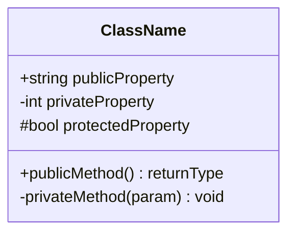
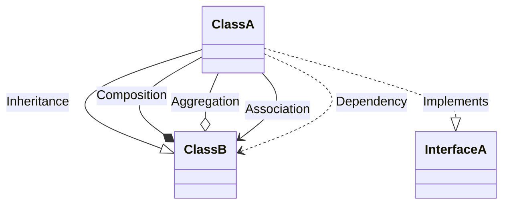
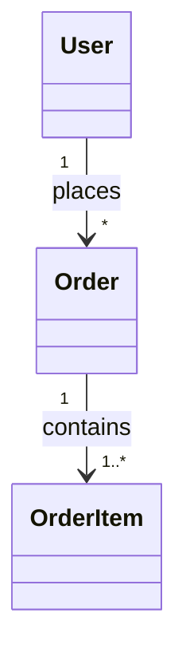
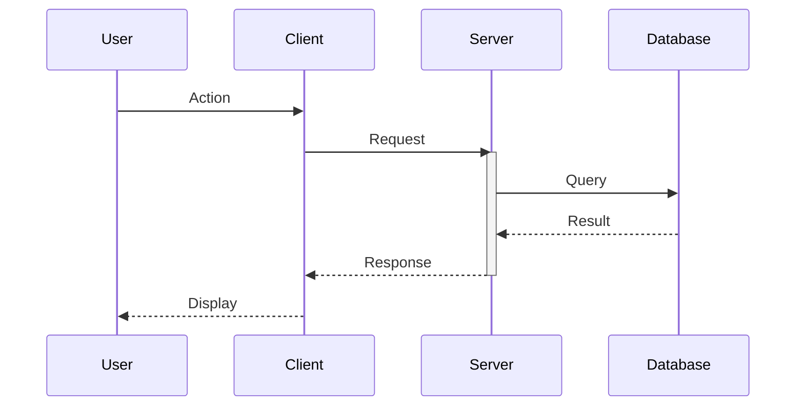
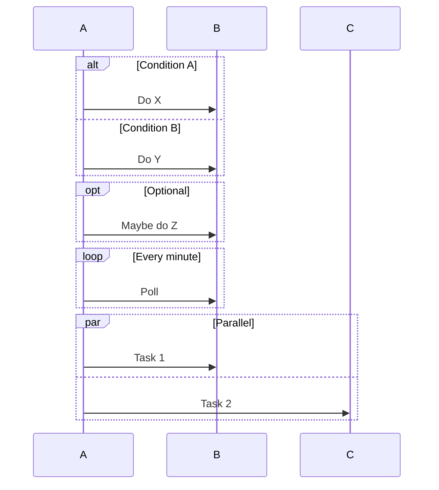
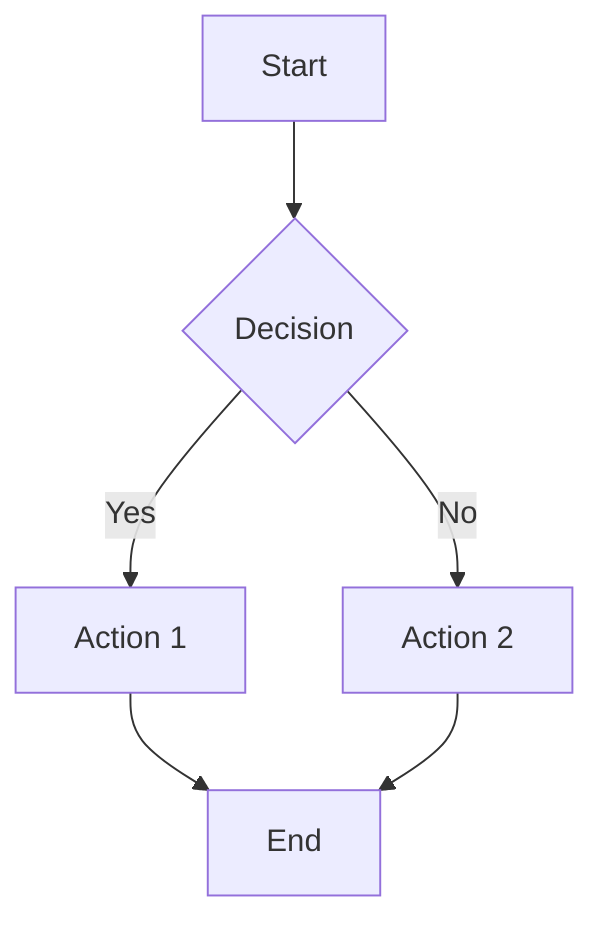
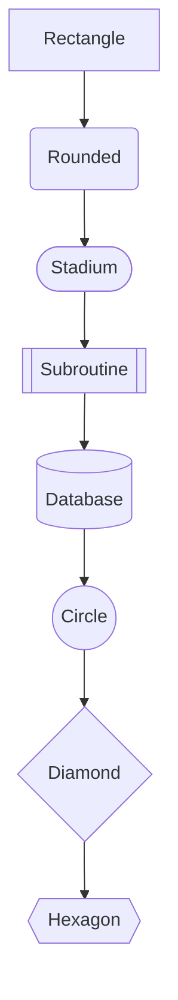
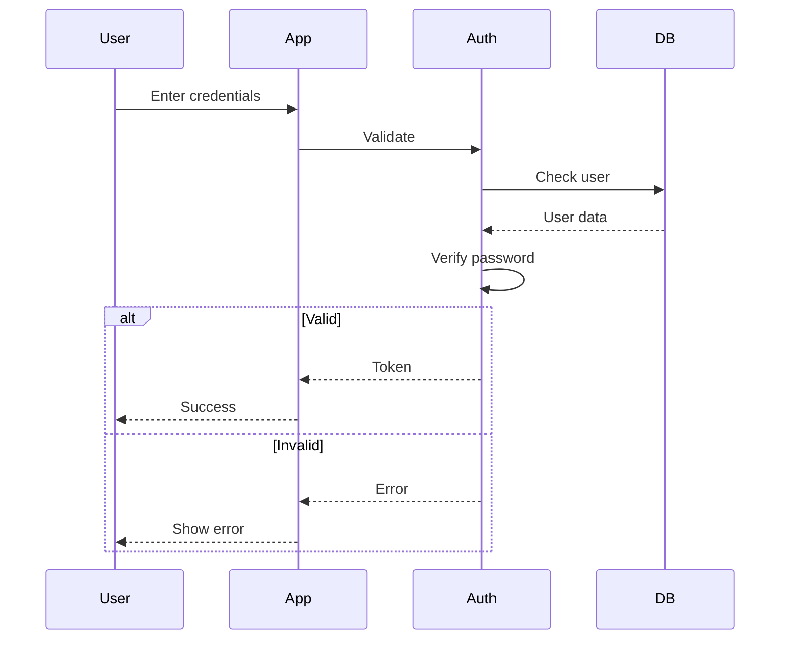
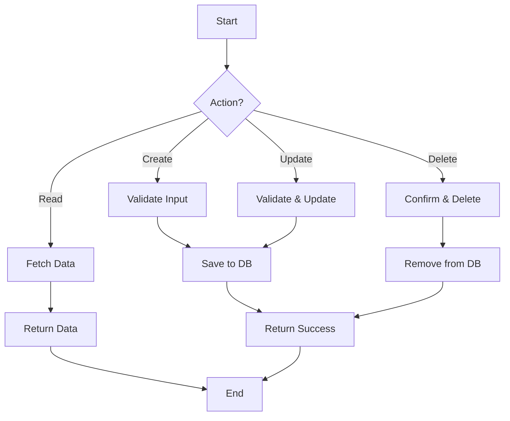
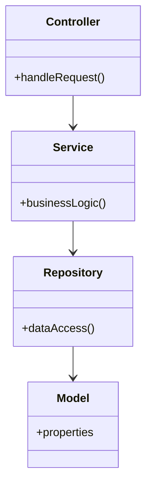

# Diagram Generation Skill

Expert guidance for creating UML diagrams using Mermaid syntax.

## When to Use

- During `/saga diagram` command
- When documenting system architecture
- When explaining complex flows

## Diagram Types

### 1. Class Diagram

Shows system structure: classes, properties, methods, relationships.



**Relationships:**


**Multiplicity:**


### 2. Sequence Diagram

Shows interactions over time between participants.



**Control Flow:**


### 3. Flowchart

Shows process flow and decision points.



**Node Shapes:**


**Directions:**
- `TD` or `TB`: Top to Bottom
- `BT`: Bottom to Top
- `LR`: Left to Right
- `RL`: Right to Left

## Best Practices

### Class Diagrams

1. **Focus on key classes**: Don't include every class
2. **Show important relationships**: Skip trivial dependencies
3. **Group by domain**: Use packages/namespaces
4. **Hide implementation details**: Focus on interfaces

### Sequence Diagrams

1. **One scenario per diagram**: Keep focused
2. **Name participants clearly**: Use roles, not classes
3. **Show happy path first**: Add error flows separately
4. **Limit participants**: 5-7 max for readability

### Flowcharts

1. **Single entry/exit**: Clear start and end
2. **Consistent direction**: Usually top-to-bottom
3. **Label all edges**: Especially decision branches
4. **Subgraphs for grouping**: Use for complex flows

## Codebase Analysis Patterns

When generating from code:

### Finding Classes (TypeScript/JavaScript)
```regex
export\s+(class|interface|type)\s+(\w+)
```

### Finding Methods
```regex
(async\s+)?(\w+)\s*\([^)]*\)\s*[:{]
```

### Finding Relationships
- Imports → Dependencies
- `extends` → Inheritance
- Properties with type → Association
- `new` usage → Dependency

## Common Diagram Templates

### Authentication Flow


### CRUD Entity Flow


### Layer Architecture


## Mermaid Limitations

- No overlapping relationships (use subgraphs)
- Limited styling options
- Some complex UML not supported
- Large diagrams can be hard to read

## Output Guidelines

1. **Save to `.saga/diagrams/`**
2. **Use descriptive filenames**: `class.mmd`, `sequence-auth.mmd`
3. **Add comments**: `%% Description`
4. **Include render instructions**: Link to mermaid.live

## Validation

Test diagrams at:
- https://mermaid.live
- GitHub/GitLab markdown preview
- VS Code with Mermaid extension
